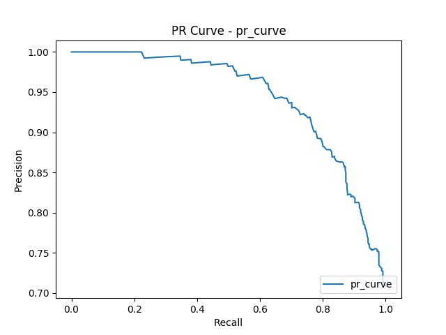
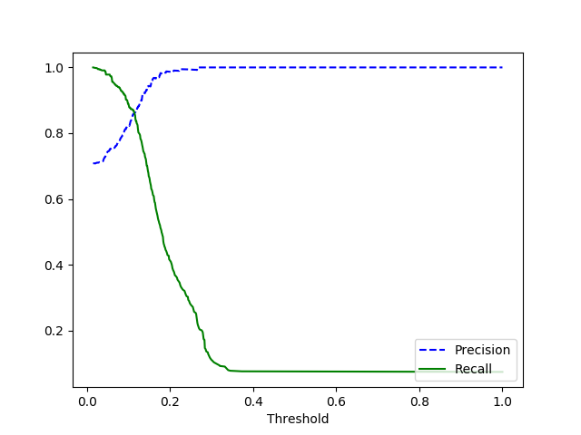
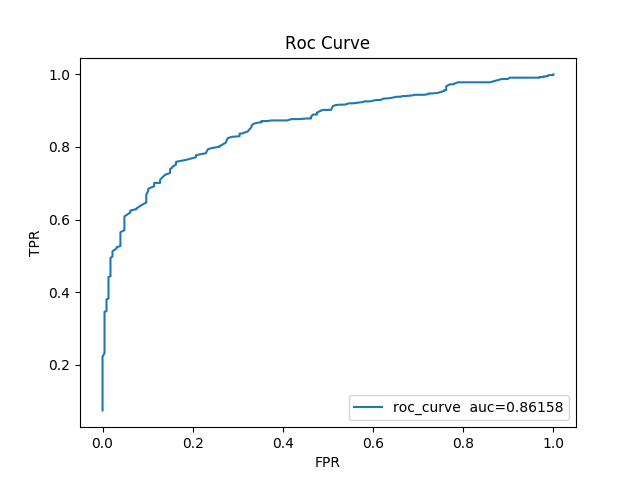

# evaluate_metric
质量评估工具

* precision recall 曲线

* roc 曲线

## deps
```
pip install -U sklearn matplotlib pylab
```

## run 
```
python evaluate_curves.py
```







## usage
[docs](http://scikit-learn.org/stable/modules/generated/sklearn.metrics.precision_recall_curve.html
)

参考 ```evaluate_curves.py```.